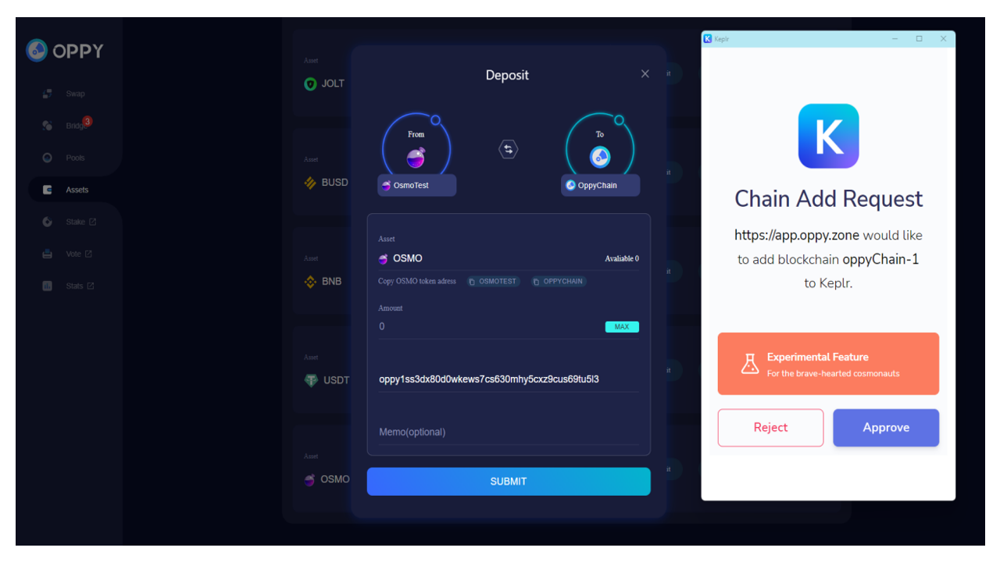
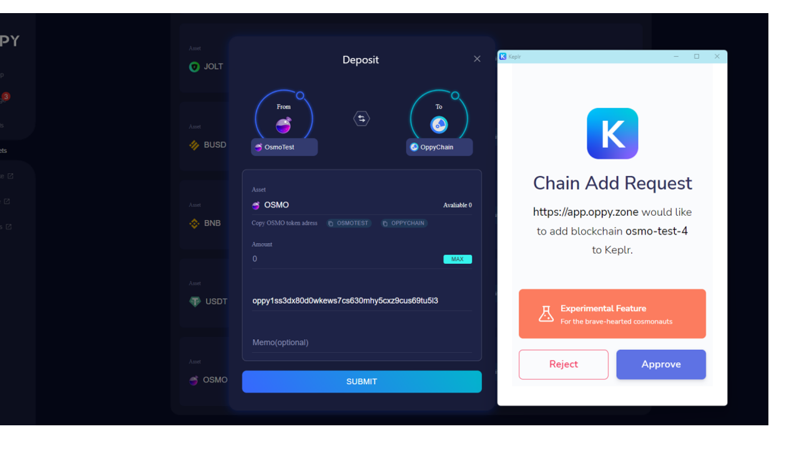
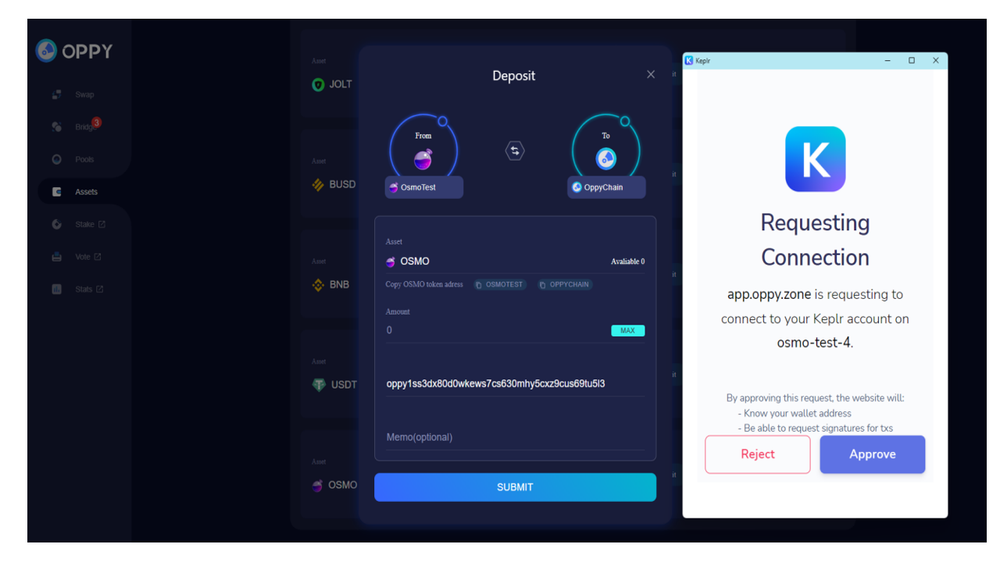
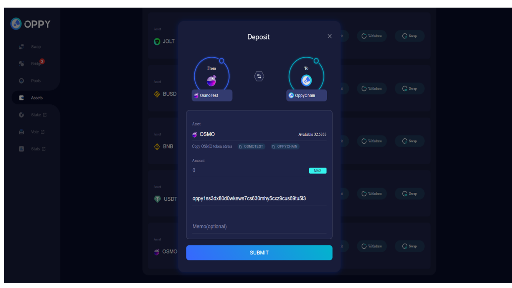
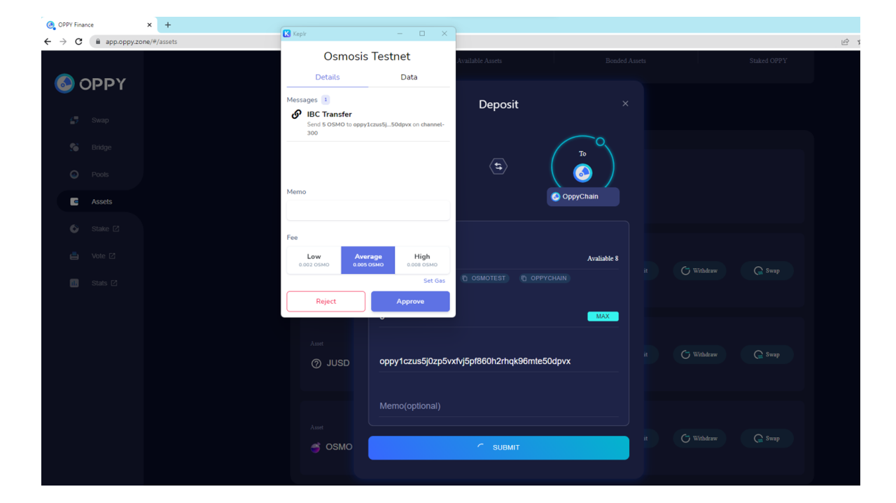

# Deposit Tokens Into OPPY Chain

First, you need to connect your wallets. OPPY has the ability not only swap the tokens from Cosmos ecosystem, but also from BSC, ETH as well. If you deposit tokens from IBC (Inter-Blockchain Communication protocol (IBC)) Cosmos ecosystem, you only need to connect Keplr wallet, if you deposit tokens from BSC or other EVM based chains, you need to connect Keplr wallet and MetaMask wallet.&#x20;

**The following example is a **<mark style="color:red;">**hypothetical deposit**</mark>** of your **<mark style="color:red;">**OSMO from Osmosis chain to OPPY chain**</mark>** for the future swap.**&#x20;

&#x20;** **<mark style="color:red;">**The screenshots were from a OPPY testnet chain and a OSMO testnet chain and only for illustration purpose, not on the real OPPY and Osmosis Chains.**</mark>&#x20;

(By the time you use [app.oppy.zone](https://app.oppy.zone/), you should be using  the OPPY real chain and do the transfers between other main nets and OPPY chain rather than the test nets.)

Click the "Asset" tab in the left menu and goes to "My OPPY Assets" page. It shows the tokens OPPY chain can take as deposits for the future swap, lending etc.&#x20;

.png>)

This example is a hypothetical deposit of OSMO. Scroll down and find OSMO. Click "Deposit"

.png>)

There are two parties involved in this deposit process, Osmosis chain (testnet) and Oppy chain(testnet). If this is the first time you use  these two chains, there will be requests asking for your permission to add the chains (OPPY chain and Osmosis chain) into the Keplr wallet.&#x20;

After two chains area added into Keplr, you need to approve OPPY chain to connect with Osmosis chain.&#x20;

Now it is all set to deposit OSMO into OPPY chain. &#x20;

Choose the gas fee and approve for the transfer. Then it is successful!&#x20;

.png>)

You can now check your OSMO in OPPY chain in "My OPPY Assets".
