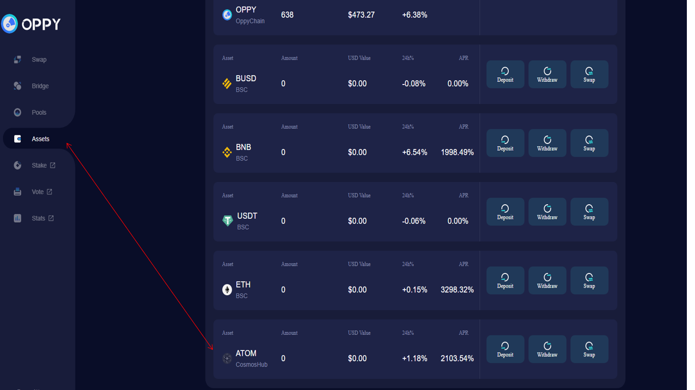
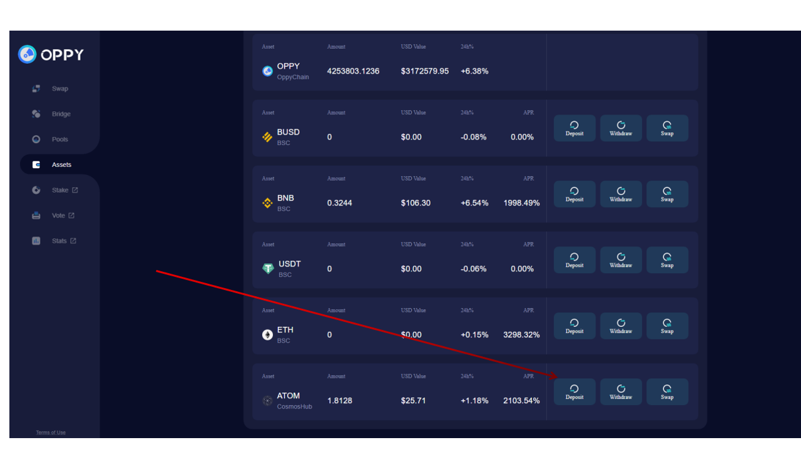
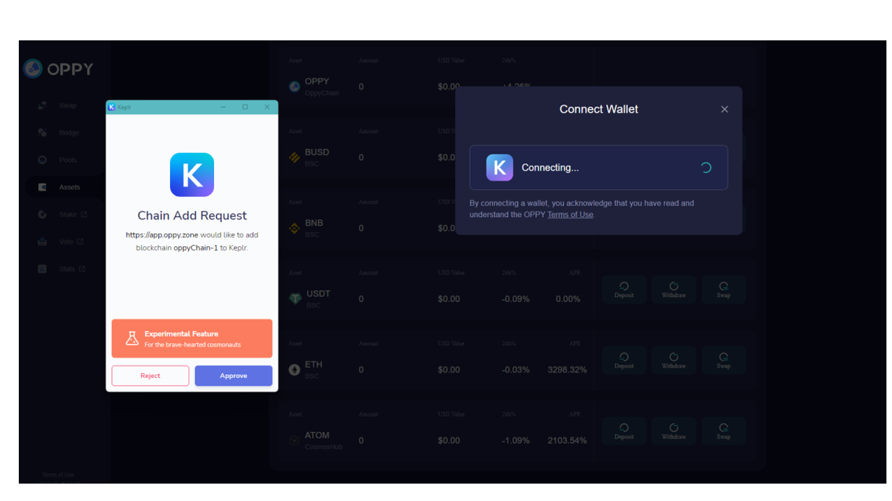
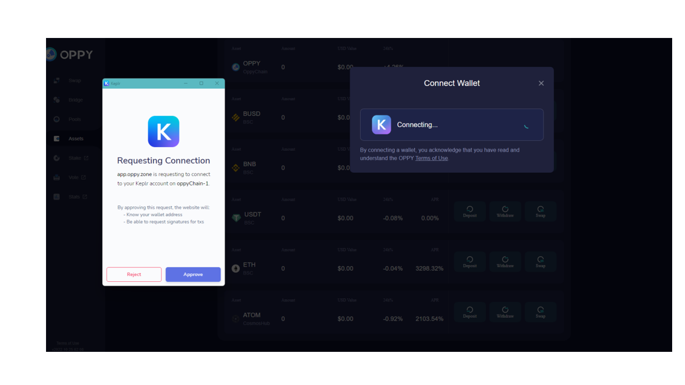
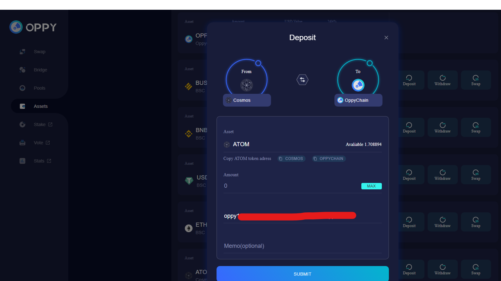
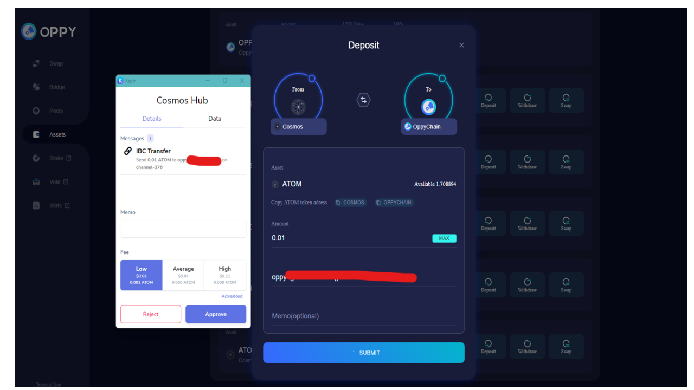
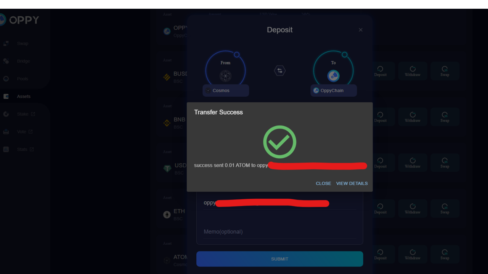

# Deposit Tokens Into OPPY Chain

First, you need to connect your wallets. OPPY has the ability not only swap the tokens from Cosmos ecosystem, but also from BSC, ETH as well. If you deposit tokens from IBC (Inter-Blockchain Communication protocol (IBC)) Cosmos ecosystem, you only need to connect Keplr wallet, if you deposit tokens from BSC or other EVM based chains, you need to connect Keplr wallet and MetaMask wallet.&#x20;

**The following example is a **<mark style="color:red;">**deposit**</mark>** of your ATOM **<mark style="color:red;">**from ATOM chain to OPPY chain**</mark>** for the future swap.**&#x20;

&#x20;** **<mark style="color:red;">**The screenshots were only for illustration purpose.**</mark>&#x20;

<figure><figcaption></figcaption></figure>

Click the "Asset" tab in the left menu and goes to "My OPPY Assets" page. It shows the tokens OPPY chain can take as deposits for the future swap.&#x20;

This example is a deposit of ATOM. Scroll down and find ATOM. Click "Deposit"

<figure><figcaption></figcaption></figure>

There are two parties involved in this deposit process, ATOM chain and Oppy chain. If this is the first time you use  OPPY chain, there will be requests asking for your permission to add the OPPY chain into the Keplr wallet.&#x20;

<figure><figcaption></figcaption></figure>

After OPPY chain  added into Keplr, you need to approve OPPY chain to connect to your Keplr account.&#x20;

<figure><figcaption></figcaption></figure>

Now it is all set to deposit ATOM into OPPY chain. &#x20;

<figure><figcaption></figcaption></figure>

<figure><figcaption></figcaption></figure>

Choose the gas fee and approve for the transfer. Then it is successful!&#x20;

<figure><figcaption></figcaption></figure>

You can now check your ATOM in OPPY chain in "My OPPY Assets".
