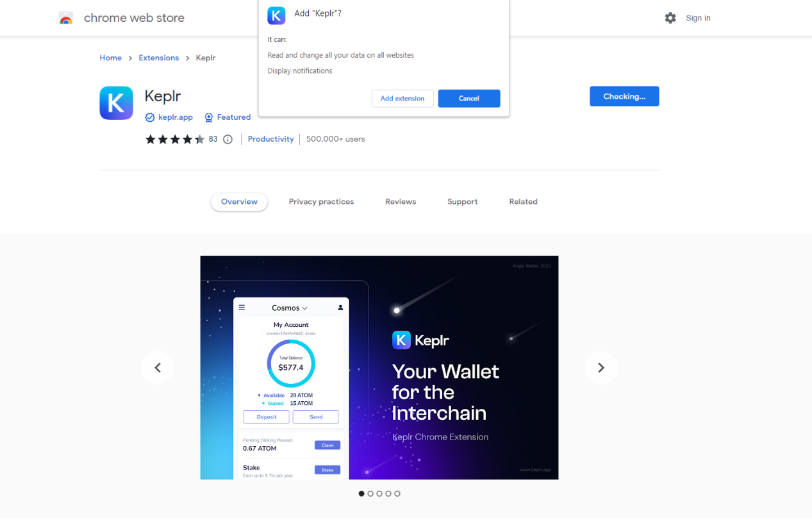
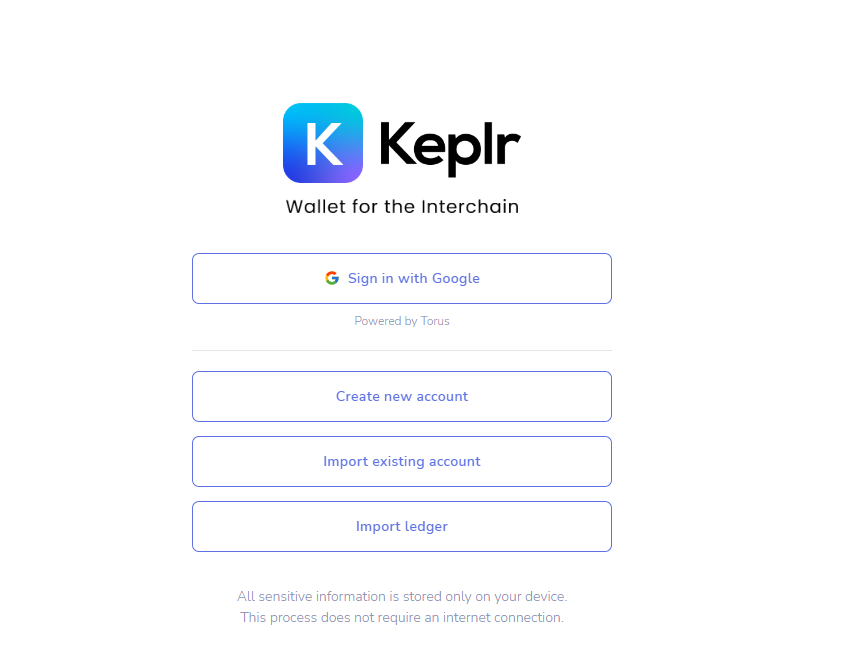
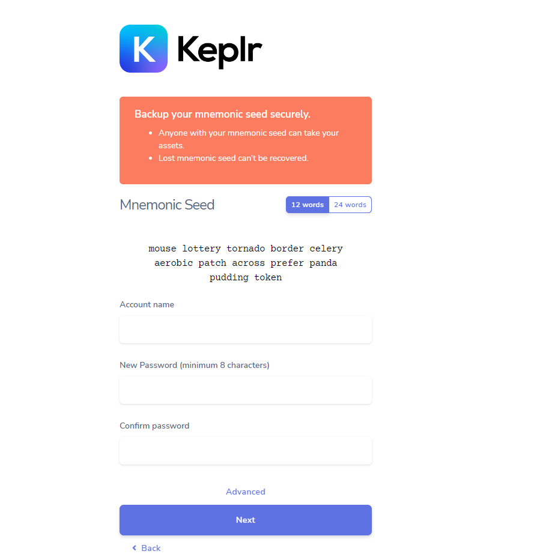

# Install Keplr Wallet

Goes to Google Chrome extension store and search for Keplr.

.png>)

After adding Keplr into the extension, you will see there are several ways for you to sign in Keplr. "Sign in with Google", "Create new account", "Import existing account" or "Import Ledger".

In this tutorial, we only show how to create a new account.  Click "Create new account". It generates a random mnemonic seed for your wallet. You can choose either 12 words seed or 24 words seed.  For the illustration purpose, the Mnemonic seed for this wallet is shows here.

After backup your Mnemonic seed and set up your account name and password, you can now go to next step.&#x20;
