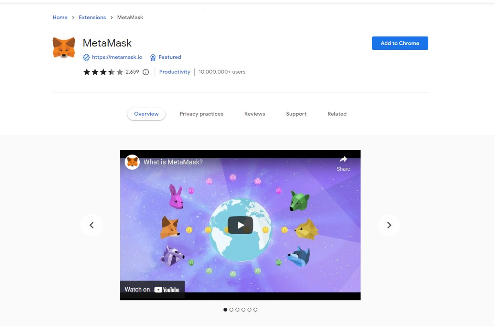
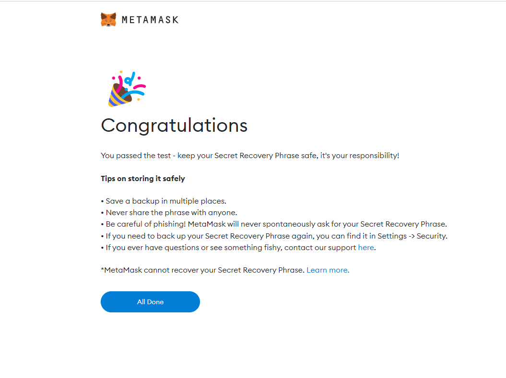

# Install  MetaMask Wallets

#### **Search Metamask In The Chrome Web Store**

.png>)

**Go to Next steps**

After confirm "Add extension", You will see  this "Welcome to Metamask" Page which means you are ready to start using Metamask in your Google Chrome.&#x20;

There will be two choices. One is for the users who already have an existing wallet before and just want to import existing wallet to this new wallet. Users need to use a Secret Recovery Phrase. Another one is for the complete new users who do not have an existing wallet. &#x20;

For this tutorial, we focus on the new users. So we go to "Create Wallet".

Click "I agree" if you agree with MetaMask terms, then it goes to the "Create Password" stage.

After setting up the password, you will see a "Secret Recovery Phrase" page.  Remember Secret Recovery Phrase is very important. Anyone who has this phrase can take your tokens from your wallet forever.  For the illustration purpose,  The phrase of this tutorial is shown at the picture.

Memorize the phrase, now we can go to the next step.  You need to confirm your Secret Recovery Phrase from the previous step.&#x20;

Now it is all set for your new MetaMask Wallet.

