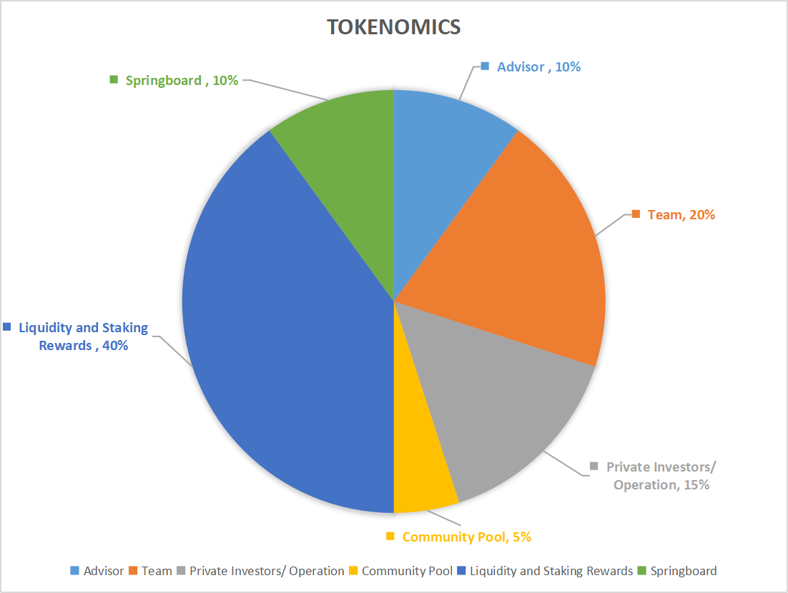
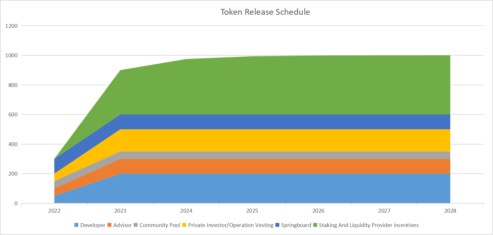

# Tokenomics

### Token Distribution

<figure><figcaption></figcaption></figure>

The tokens will be distributed to:

Liquidity and Staking Rewards: 40% which includes 32.8% in staking rewards and 7.2% in liquidity mining incentives.

Developer : 20%.

Advisors : 10%.

Community Pool : 5%.

Private investors/ Operation : 15%.

15% of the tokens will be sold to private investors to cover the operation costs including rent, payroll, utilities, cloud services etc.

The crypto market is in the cold winter. If there is no fund available. Core team and advisors will take the risk and cover the ongoing expenses incurred to demonstrate its confidence of the project until the project  progressively decentralize towards community owned protocol. As the compensation, the tokens will be paid back to the core team and advisors in up to 12 months period.

Springboard: 10%.

To encourage the new users to participant in the OPPY.  10% will be given to the users who participate in the bootstrapping of the OPPY chain for the first 3 to 6 months as the springboard plan. It will be distributed as airdrops to active community members, promoters, bonus to the bootstrap liquidity providers, bonus to the bootstrap nodes etc.

### Token Release Schedule

The anticipated token unlock schedule is as follows:

<figure><figcaption></figcaption></figure>

