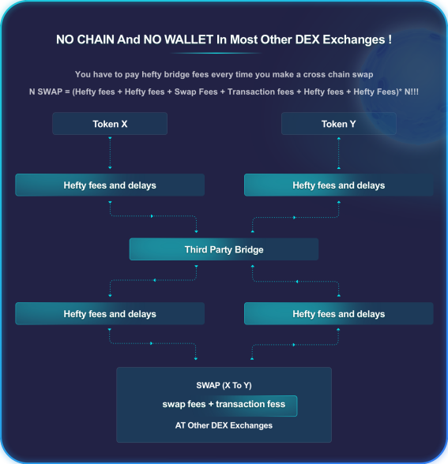

# Background

## Block **Chains Are Isolated Islands With Very Few Bridges** 

There are some pioneers in the AMM and cross chain protocols, such as Osmosis, Thorchain, Anyswap.  They bring in the innovatory in the blockchains and make all chains more connected towards one seamless world.  However, blockchain is such a rapid evolving technology and still full of potential. There is still some much room for improvement.

For example, in Cosmos network alone, there are currently more than 263 [apps and services](https://cosmos.network/ecosystem/apps) with over $142 billion of digital assets under management.IBC only appears in Cosmos ecosystem last year in 2021. But now there are more than 200 chains are connected via IBC and Cosmos alone recorded over $150 million in IBC transaction in 24 hours. The swap volume from one of the famous AMMs in BSC chain, pancake, was $180 million in the last 24 hours.  However, there are still very few  AMMs to make pairs in these two ecosystems swap more easily and freely.

## **The Cost Of Bridging Is High And Bridging Is Very Time Consuming**

Until now, the process of exchange token X from one chain to token Y from another chain is quite tedious and cost is high.

<figure><figcaption></figcaption></figure>
