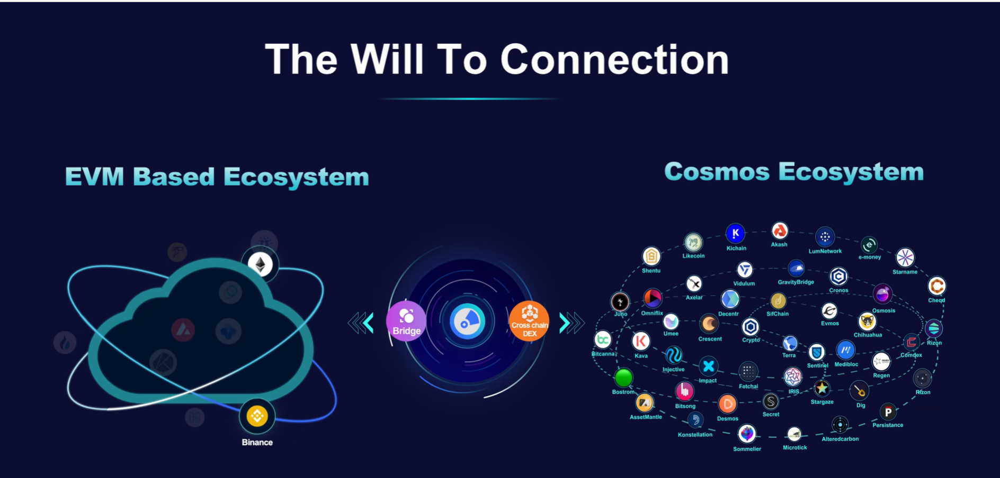

# Philosophy --The Will To Connection

We believe in the philosophy of cosmos.  Interoperability and autonomy over siloes and monopolies, collaboration and innovation over competition and status quo.

We believe in creating the real value to the community rather than fancy names and rules.

We believe in bringing in the value to our community and our token holders. Thus, we carefully design the tokenomics and lending rules, AAM rules not only for the benefits of community, but also benefits of the token holders.

<figure><figcaption></figcaption></figure>
