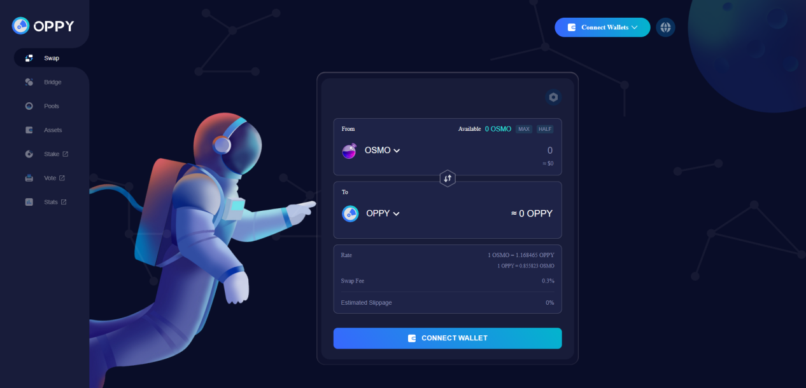

# Cross Chains DEX

Our aim is to make the whole chains even connected. We have no intention to reinvent the wheels, on the contrary, we want to add our strength on the shoulders of our pioneers. To put it simple, we want to make a seamless AMM markets for tokens in IBC chains and ETH, Avalanche, Solana, BSC chains etc. Oppy’s strength is to make bridges for different chains. Current codes include forked codes from Osmosis for swap, pools which were audited via Certik. The bridge codes are developed via Oppy team and will be audited when further developments are done for other chains such as Ethereum and Solana etc.

<figure><figcaption></figcaption></figure>

