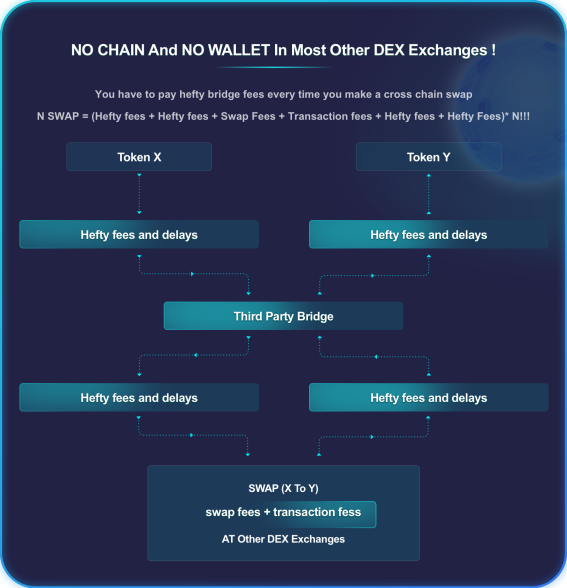
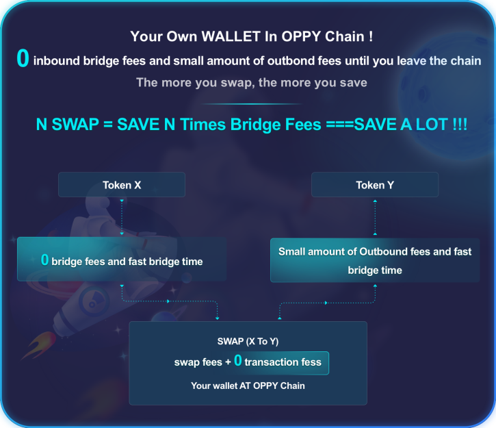

# The Difference Between OPPY And Other Bridges

There are some bridges such as Wormhole and Multichain. The function they have is quite simple- To transfer the same token X from Chain A to Chain B as a wrapped token X.    But most of the case, the reason users transfer tokens from Chain A to Chain B is not for transfer's sake. It is to swap token X to some token Y in the other Chain B. &#x20;

Some Cross Chain DEX Dapps are built upon **** wormhole protocol to help users solve this problem. But it brings in the cost issue.&#x20;

<figure><figcaption></figcaption></figure>

OPPY has the own bridge build on its own Chain.  By using its own L1 chain, users can have wallets in OPPY Chain. It does not need to go through the bridge to exchange tokens every time they have needs. It save dramatically from N bridge fees to 1 bridge fee. &#x20;

Plus, since the validators of the OPPY chain act as the node for OPPY DEX and bridge. They have multi source of income. It does not need to charge the same hefty bridge fees as the independent third party bridges fees which gives Oppy another layer of strength to further reduce the cost for cross chain users.  For example, the inbound bridge fees are **ZERO.**&#x20;

****

<figure><figcaption></figcaption></figure>
